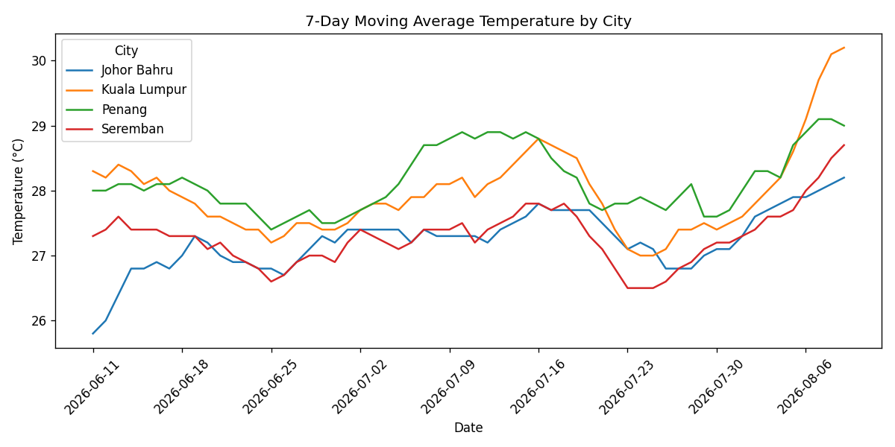
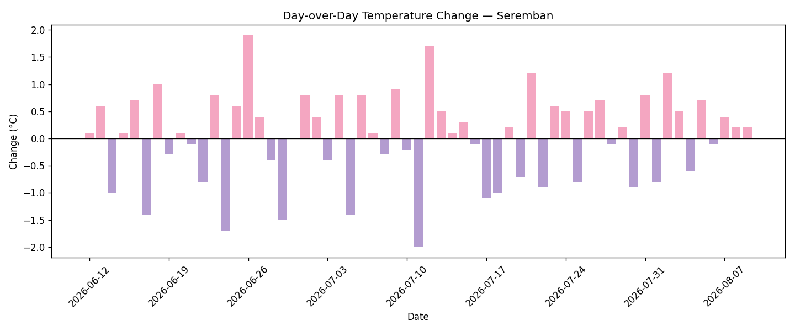
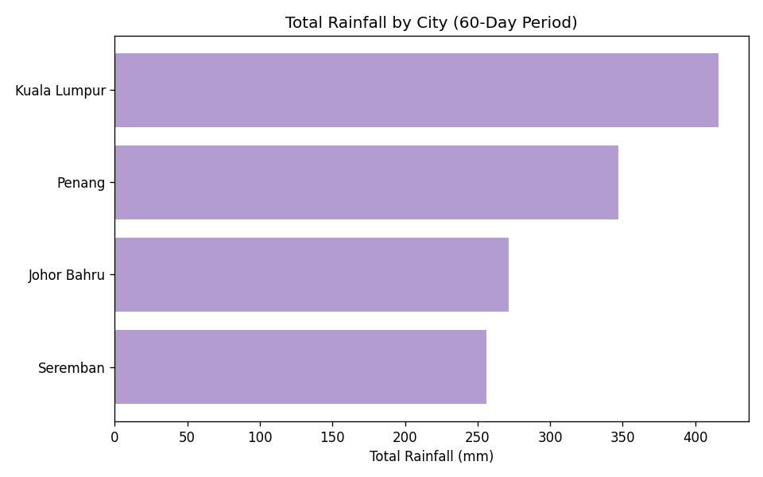
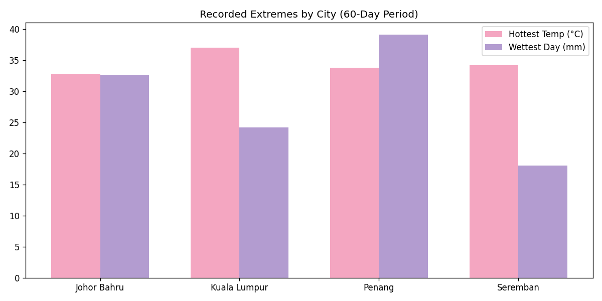

# Weather ETL Pipeline

A scheduled ETL pipeline that extracts weather data for four Malaysian cities
(Seremban, Kuala Lumpur, Penang, Johor Bahru) from the Open-Meteo API,
transforms and validates it, and loads it into PostgreSQL for trend analysis.

## Status
✅ Complete — runs daily via GitHub Actions

## Architecture

Open-Meteo API → Extract → Transform (validate) → Load (idempotent upsert) → PostgreSQL
↓
SQL Analysis Views
↓
Chart Export (matplotlib)

Scheduled daily via GitHub Actions cron, writing to a Neon (serverless
Postgres) cloud database. See `.github/workflows/daily-pipeline.yml`.

## Tech Stack
- Python 3.14 (requests, pandas, matplotlib, psycopg)
- PostgreSQL 18 (local dev) / Neon (production, scheduled runs)
- GitHub Actions (scheduling via cron)
- Open-Meteo API (no key required)

## Data Quality & Reliability
- **Idempotent loading**: reruns for the same date overwrite rather than
  duplicate, via `ON CONFLICT (city_id, reading_date) DO UPDATE`
- **Validation**: rejects records with missing values, impossible
  temperature ranges, or negative rainfall; flags outlier temperatures
  for review without rejecting them
- **Audit trail**: every pipeline run is logged in `pipeline_runs`
  (start/finish time, status, rows loaded, error message on failure)

## Trend Analysis

### 7-Day Moving Average Temperature

### Day-over-Day Temperature Change (Seremban)

### Total Rainfall Ranking

### Recorded Extremes by City

## Project Structure

src/
extract/ # Open-Meteo API calls
transform/ # Validation & cleaning
load/ # Idempotent upsert into Postgres
charts/ # Chart generation from SQL views
main.py # Daily pipeline orchestration
backfill.py # One-time historical data load
sql/
schema/ # Table definitions
views/ # Analysis views (moving average, rankings, etc.)
.github/workflows/
daily-pipeline.yml # Scheduled GitHub Actions job

## Setup

1. Clone the repo and create a virtual environment:

python -m venv venv
venv\Scripts\activate
pip install -r requirements.txt

2. Copy `.env.example` to `.env` and fill in your `DATABASE_URL`
3. Apply the schema: `psql -d your_db -f sql/schema/001_create_tables.sql`
4. Apply the views: `psql -d your_db -f sql/views/001_analysis_views.sql`
5. Seed cities (see `sql/schema/001_create_tables.sql` comments for the INSERT)
6. Run the pipeline: `python -m src.main`

## Future Improvements

- **More cities / configurable city list**: currently hardcoded to 4
  Malaysian cities in `src/extract/config.py`; could be extended to
  read from a config file or command-line argument.
- **Alerting on pipeline failure**: `pipeline_runs` already logs
  failures, but nothing currently notifies a human when one occurs
  (e.g. a GitHub Actions step that posts to Slack/email on failure).
- **Automated tests**: validation logic in `src/transform/clean.py`
  is manually verified; a `tests/` suite with pytest would formalize
  this and catch regressions.
- **Dashboard instead of static charts**: charts are currently static
  PNGs regenerated on demand; a lightweight Streamlit or web dashboard
  could make them live/interactive (deliberately deferred for this
  project -- see README's project goals).
- **Schema migrations tool**: SQL files are numbered and applied
  manually; a tool like Alembic or Flyway would automate applying
  new schema changes across environments.
- **City config duplication**: city coordinates currently live in
  both `src/extract/config.py` and the `cities` table; a shared
  source (e.g. loading extract's config from the database, or vice
  versa) would remove this duplication at the cost of coupling
  extract to the database.